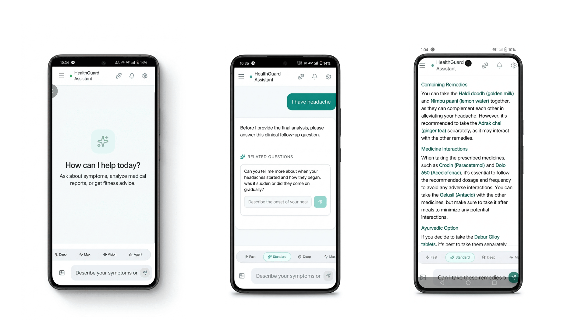
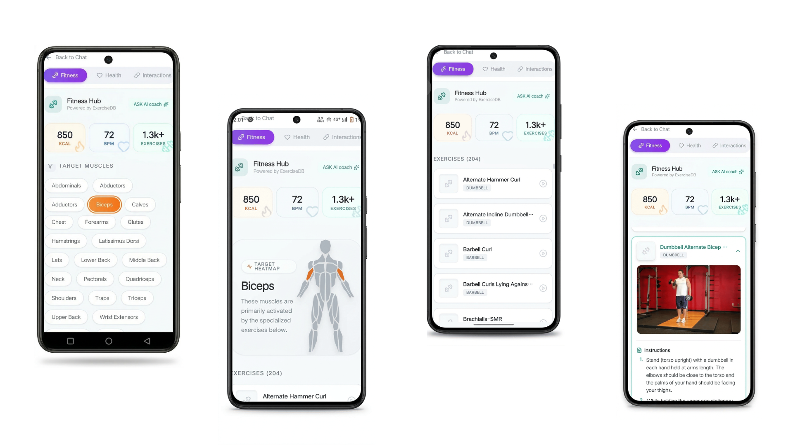
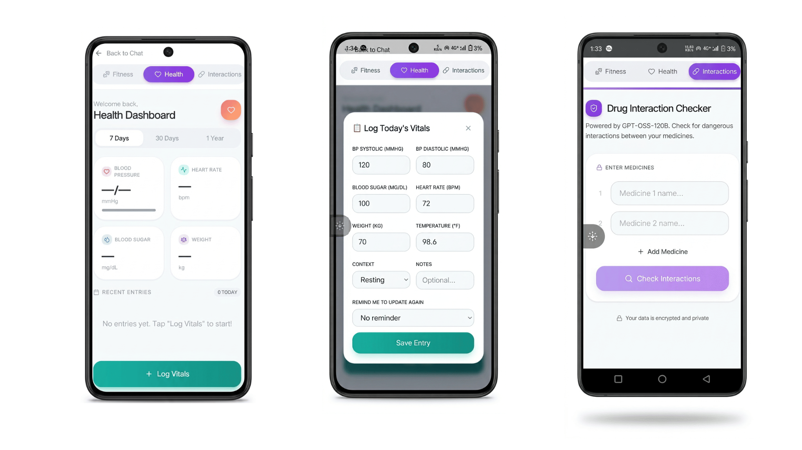

# HealthGuard AI

<div align="center">


**AI-Powered Health & Fitness Companion App**


</div>

---

## About

HealthGuard AI is a comprehensive health and fitness Android application powered by multiple AI models. It provides intelligent health chat, fitness tracking, medicine price comparison, drug interaction checking, and smart health monitoring - all in one app.

---

## Download

### Android APK (v1.0.0)
Download the latest release: [app-release.apk](releases/download/v1.0.0/app-release.apk)

---

## Features

- **AI Health Chat** - Multiple AI modes (Fast, Standard, Deep Think, Max Deep Think, Agent)
- **Fitness Hub** - 2000+ exercises with GIF animations and AI workout generation
- **Medicine Price Comparison** - Compare prices across Indian e-commerce platforms
- **Health Dashboard** - Track vitals like BP, blood sugar, weight, temperature, heart rate
- **Drug Interaction Checker** - Check drug interactions safely
- **WhatsApp Notifications** - Get medicine reminders via WhatsApp
- **Voice Input** - Talk to AI using microphone
- **Nearby Pharmacy Map** - Find pharmacies near you using Google Maps
- **PDF Reports** - Generate and download health reports
- **Chat History** - Save and manage AI conversations
- **Firebase Authentication** - Secure Google Sign-In

---

## Tech Stack

### Frontend

| Technology | Version | Purpose |
|------------|---------|---------|
| **React** | 19.2.3 | UI library for building user interfaces |
| **TypeScript** | 5.8.2 | Type-safe JavaScript development |
| **Vite** | 6.2.0 | Fast build tool and development server |
| **React Router DOM** | 7.13.0 | Client-side routing |
| **Tailwind CSS** | - | Utility-first CSS framework |
| **Framer Motion** | 12.38.0 | Animation library for React |
| **Lucide React** | 0.562.0 | Beautiful icon library |

### Mobile (Android)

| Technology | Version | Purpose |
|------------|---------|---------|
| **Capacitor** | 8.1.0 | Native Android app wrapper |
| **Capacitor Android** | 8.1.0 | Android platform support |
| **Capacitor Firebase Authentication** | 8.1.0 | Native Google Sign-In |
| **Capacitor Geolocation** | 8.1.0 | GPS location access |
| **Capacitor Google Maps** | 8.0.1 | Native Google Maps integration |

### AI & Machine Learning

| Technology | Version | Purpose |
|------------|---------|---------|
| **Google Gemini AI** | 1.38.0 | Primary AI model for health chat |
| **Google Generative AI** | 0.24.1 | Gemini API integration |
| **Groq SDK** | 0.37.0 | Fast LLM inference for quick responses |
| **LangChain** | 0.3.26 | LLM orchestration framework |
| **LangGraph** | 0.2.36 | Stateful multi-agent workflows |
| **LangChain Google GenAI** | 0.1.8 | Gemini integration for LangChain |

### AI Architecture (How It Works)

```
┌─────────────────────────────────────────────────────────┐
│                    HealthGuard AI                        │
├─────────────────────────────────────────────────────────┤
│                                                          │
│  ┌─────────────┐    ┌─────────────┐    ┌─────────────┐ │
│  │   Fast Mode │    │Standard Mode│    │Deep Think   │ │
│  │   (Groq)    │    │  (Gemini)   │    │  (Gemini)   │ │
│  └──────┬──────┘    └──────┬──────┘    └──────┬──────┘ │
│         │                  │                   │        │
│         └──────────────────┼───────────────────┘        │
│                            │                            │
│                   ┌────────▼────────┐                   │
│                   │  LangGraph      │                   │
│                   │  (State Machine)│                   │
│                   └────────┬────────┘                   │
│                            │                            │
│         ┌──────────────────┼──────────────────┐         │
│         │                  │                  │         │
│  ┌──────▼──────┐    ┌─────▼─────┐    ┌──────▼──────┐  │
│  │  Clinical   │    │  Vitals   │    │  Medicine   │  │
│  │  Graph      │    │  RAG      │    │  Search     │  │
│  │  Agent      │    │  System   │    │  Agent      │  │
│  └─────────────┘    └───────────┘    └─────────────┘  │
│                                                          │
└─────────────────────────────────────────────────────────┘
```

#### LangGraph Clinical Agent
- Uses **LangGraph StateGraph** for clinical conversation flow
- Implements **SOCRATES framework** for medical history taking
- **Stateful conversations** with MemorySaver checkpointer
- **Multi-node workflow**: Intent Extraction → Information Gathering → Clinical Abstraction → Medical Search → Diagnosis

#### Vitals RAG System
- **Retrieval-Augmented Generation** for health context
- Stores user vitals in localStorage
- Analyzes trends and abnormal values
- Injects health context into every AI model's system prompt
- Ensures all AI modes are aware of user's health condition

#### Agentic AI Tools
- **Function Calling** with Google Gemini
- **searchMedicine** - Search medicine prices across platforms
- **setHealthAlert** - Set health reminders and alerts
- **Workout Generation** - AI-powered personalized workout plans

### Backend

| Technology | Version | Purpose |
|------------|---------|---------|
| **Python Flask** | Latest | REST API server |
| **Flask-CORS** | Latest | Cross-origin resource sharing |
| **MongoDB** | - | Chat history and user data storage |
| **PyMongo** | Latest | MongoDB driver for Python |
| **Gunicorn** | Latest | Production WSGI server |
| **Python-Dotenv** | Latest | Environment variable management |

### Backend Services

| Service | Purpose |
|---------|---------|
| **Medicine Price Search** | SerpAPI integration for price comparison |
| **Exercise Database** | 2000+ local exercises with GIF support |
| **Workout Generator** | Groq LLM for personalized workout plans |
| **Drug Interaction Checker** | OpenRouter AI for drug interaction analysis |
| **Chat History** | MongoDB for persistent chat storage |
| **Stripe Integration** | Payment processing (removed for free version) |
| **Twilio WhatsApp** | WhatsApp notification service |

### APIs & External Services

| API | Purpose |
|-----|---------|
| **Google Gemini** | Primary AI model for health chat |
| **Groq** | Fast inference for quick responses |
| **OpenRouter** | Drug interaction analysis |
| **SerpAPI** | Medicine price search across platforms |
| **Firebase** | Authentication (Google Sign-In) |
| **Google Maps** | Nearby pharmacy location |
| **Twilio** | WhatsApp notifications |
| **NVIDIA Whisper** | Voice transcription (web only) |
| **MongoDB Atlas** | Cloud database for chat storage |

### Maps & Location

| Technology | Version | Purpose |
|------------|---------|---------|
| **Leaflet** | 1.9.4 | Interactive maps library |
| **React Leaflet** | 5.0.0 | React wrapper for Leaflet |
| **Google Maps API** | 2.20.8 | Google Maps React component |

### PDF Generation

| Technology | Version | Purpose |
|------------|---------|---------|
| **jsPDF** | 4.1.0 | PDF document generation |
| **jsPDF AutoTable** | 5.0.7 | Table generation in PDFs |

### Markdown & Rich Text

| Technology | Version | Purpose |
|------------|---------|---------|
| **React Markdown** | 9.0.1 | Render markdown in React |
| **Rehype Raw** | 7.0.0 | Parse raw HTML in markdown |
| **Remark GFM** | 4.0.1 | GitHub Flavored Markdown support |

### Other Libraries

| Technology | Version | Purpose |
|------------|---------|---------|
| **EmailJS** | 4.4.1 | Email sending from frontend |
| **React Body Highlighter** | 2.0.5 | Body muscle highlighting for exercises |

---

## Deployment

### Backend
- **Platform**: Red Hat OpenShift
- **Runtime**: Python Flask with Gunicorn
- **Database**: MongoDB Atlas (Cloud)
- **Container**: Docker

### Frontend/Android
- **Build Tool**: Vite
- **Mobile Wrapper**: Capacitor
- **Platform**: Android (APK)

---

## Architecture

```
HealthGuard-AI/
├── android/                    # Android native code (Capacitor)
│   ├── app/
│   │   ├── src/main/res/      # App icons, resources
│   │   └── build.gradle       # Android build config
├── backend/                    # Python Flask backend
│   ├── server.py              # Main API server
│   ├── agent_browser.py       # Medicine search agent
│   ├── playwright_order_agent.py  # Auto-order agent
│   └── data/exercises.json    # 2000+ exercises database
├── components/                 # React UI components
│   ├── TextChatInterface.tsx  # AI chat interface
│   ├── FitnessPanel.tsx       # Fitness hub
│   ├── HealthDashboard.tsx    # Health tracking
│   ├── DrugInteractionChecker.tsx  # Drug checker
│   ├── MedicinePriceCard.tsx  # Medicine prices
│   ├── NearbyPharmacyMap.tsx  # Pharmacy map
│   └── ...
├── src/
│   ├── agents/                # LangGraph agents
│   │   ├── clinicalGraph.ts   # Clinical conversation graph
│   │   ├── medicalKnowledgePrompts.ts  # Medical prompts
│   │   └── patientSession.ts  # Session management
│   ├── services/              # Frontend services
│   │   ├── firebaseAuth.ts    # Authentication
│   │   └── serverHealth.ts    # Server monitoring
│   ├── pages/                 # App pages
│   │   ├── Dashboard.tsx      # Main dashboard
│   │   ├── AuthPage.tsx       # Login/Signup
│   │   └── LandingPage.tsx    # Landing page
│   └── lib/                   # Utilities
├── services/                   # Shared services
│   ├── geminiService.ts       # Gemini AI integration
│   ├── groqService.ts         # Groq AI integration
│   └── vitalsRAG.ts           # RAG system for vitals
└── package.json               # Frontend dependencies
```

---

## How RAG Works in HealthGuard AI

```
┌──────────────────────────────────────────────────────┐
│                  RAG Pipeline                         │
├──────────────────────────────────────────────────────┤
│                                                       │
│  1. User enters vitals (BP, sugar, weight, etc.)     │
│                    │                                  │
│                    ▼                                  │
│  2. Vitals stored in localStorage                    │
│                    │                                  │
│                    ▼                                  │
│  3. VitalsRAG analyzes:                              │
│     - Trend analysis (improving/worsening)           │
│     - Abnormal value detection                       │
│     - Severity classification                        │
│                    │                                  │
│                    ▼                                  │
│  4. Context string generated:                        │
│     "User has elevated BP (150/95), trending worse"  │
│                    │                                  │
│                    ▼                                  │
│  5. Context injected into ALL AI model prompts       │
│                    │                                  │
│                    ▼                                  │
│  6. AI responds with health-aware context            │
│                                                       │
└──────────────────────────────────────────────────────┘
```

---

## App Screenshots

<div align="center">

### AI Health Chat & Fitness Hub


### Health Dashboard & Medicine Finder


### All Features Overview


</div>

---

## License

MIT License

---

## Developer

**Utkarsh Rana**
- GitHub: [@Rana3112](https://github.com/Rana3112)

---

<div align="center">

**Made with AI & React**

</div>
