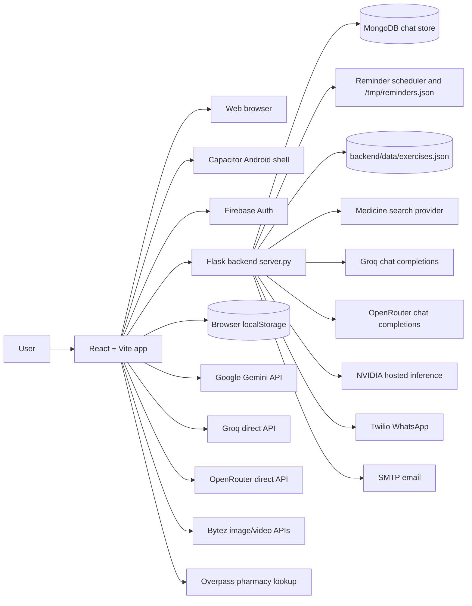
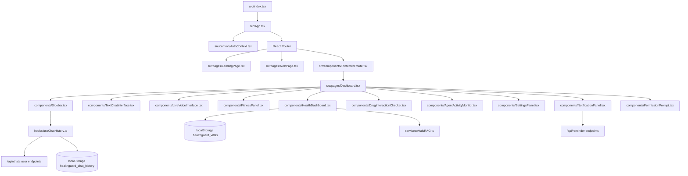
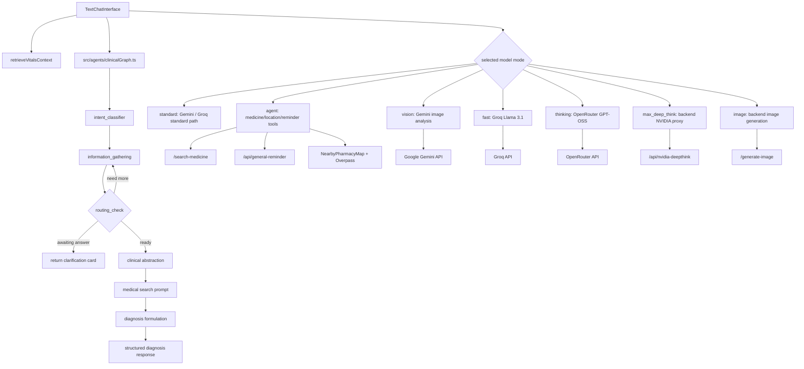
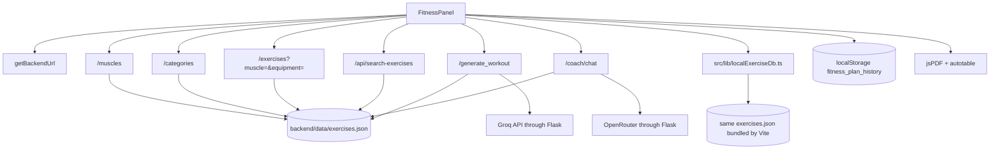
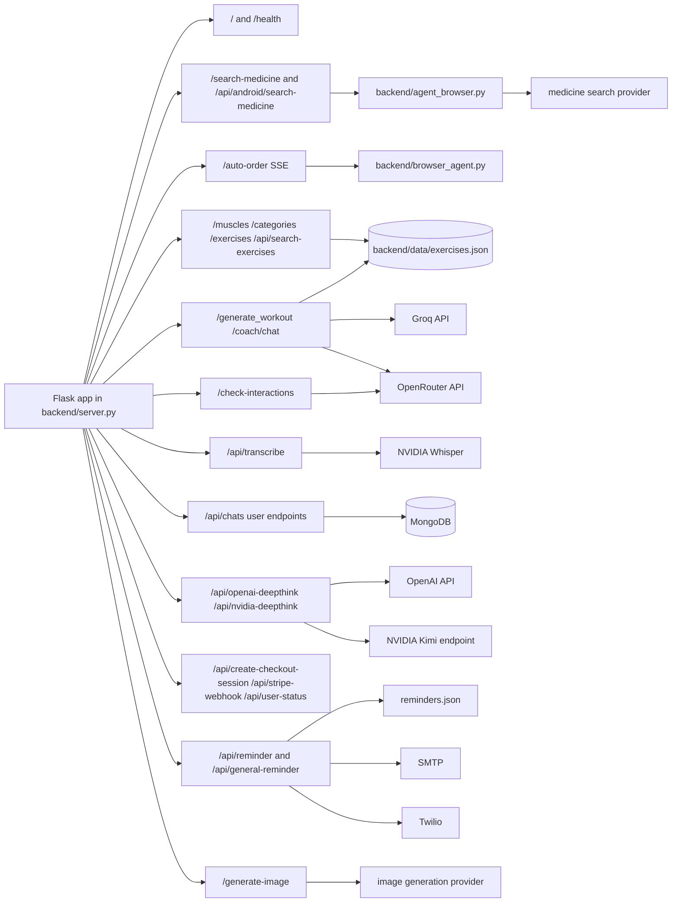
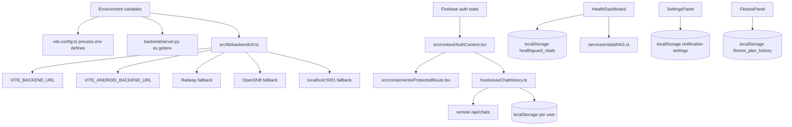

# HealthGuard AI Architecture Graph

Generated from the repository source on 2026-04-25.

## System Context

## Frontend Shell

## Chat And Clinical AI Flow

## Fitness And Exercise Flow

## Backend API Graph

## Persistence And Configuration

## Notes

- The active slash workflows in `.agent/workflows` do not include `/graphify`; this file is the repository architecture graph equivalent.
- Most frontend-to-backend calls use `src/lib/backendUrl.ts`. `hooks/useChatHistory.ts` has its own `API_BASE` fallback to the Render backend.
- The app mixes top-level folders such as `components/`, `services/`, `hooks/`, and `utils/` with `src/` folders. `vite.config.ts` aliases `@` to the repository root, so imports can cross both roots.
- The clinical flow is a real LangGraph state machine in `src/agents/clinicalGraph.ts`, while the broader chat UI still routes directly through service functions for specific modes and tools.
